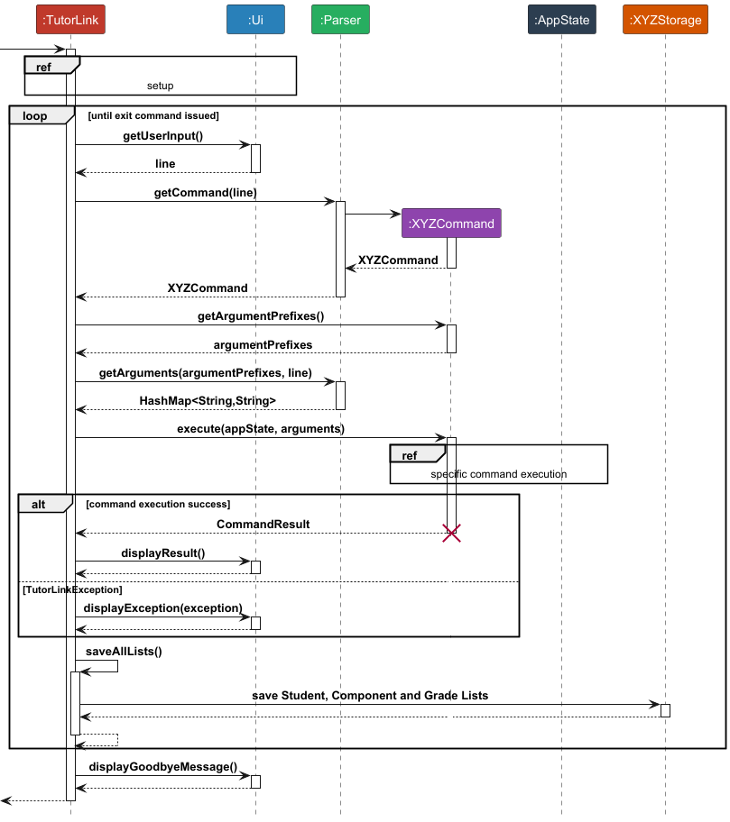
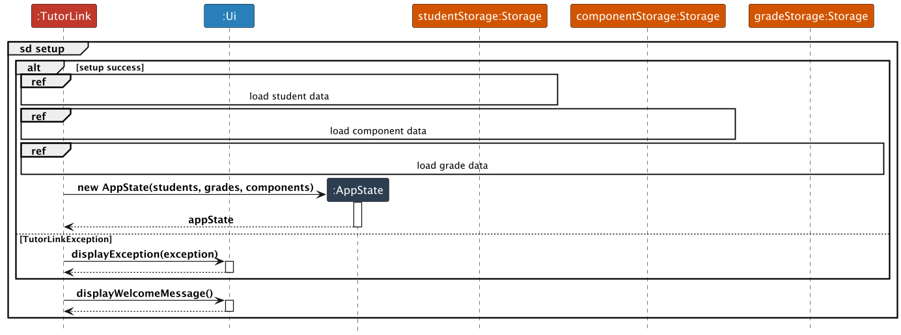
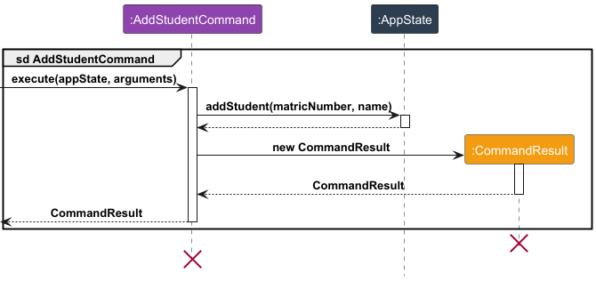
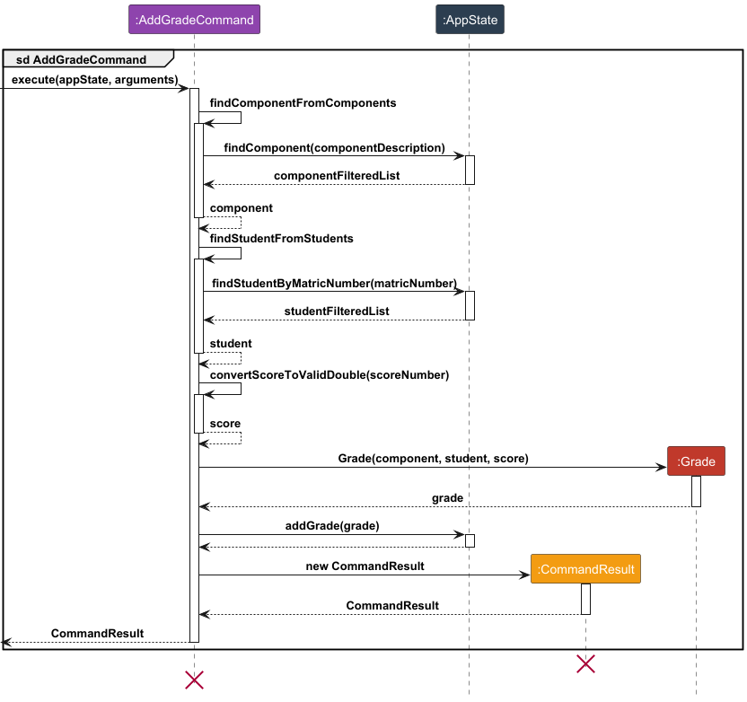
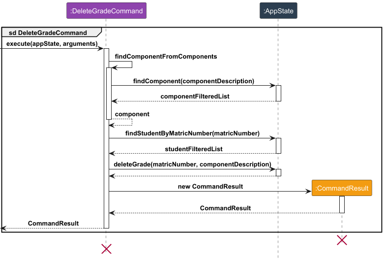
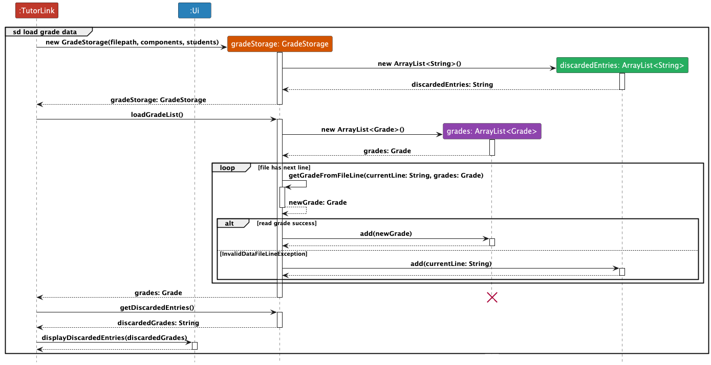

# Developer Guide

## Acknowledgements

{list here sources of all reused/adapted ideas, code, documentation, and third-party libraries -- include links to the
original source as well}

## Design & implementation

### Architecture

The high-level design of TutorLink is as depicted in the following **Architecture Diagram**:

**Main Components of the Architecture**

<code>TutorLink</code>: Main class that serves as the main entry point of the application.

- At app launch, TutorLink initializes components (<code>Parser</code>, <code>Ui</code>, <code>Storage</code>, <code>
  AppState</code>).
- On app shutdown, it shuts down the components and invokes cleanup methods.

The key classes providing functionality to TutorLink are:

1. <code>AppState</code>: Stores global variables/resources required by TutorLink at run time.
2. <code>Ui</code>: Collects data (via Strings sent via CLI) from the user and relays information to the user (via
   printing back to the CLI).
3. <code>Parser</code>: Interprets the raw data from the user; applies data validation and handles necessary exceptions.
4. <code>Storage</code>: Handles the loading and storage of data to be retained even after TutorLink is shut down.
5. <code>CommandResult</code>: Represents the result of user input.

## Implementation

### Command execution sequence: 

All commands follow the sequence as described in the diagram below: 

Where <code>ref</code> frame is a placeholder for each command's specific operations.

#### Setup:

During the setup phase of `TutorLink`, the following operations are performed:
1. `Ui` displays welcome message
2. `StudentStorage`, `ComponentStorage` and `GradeStorage` objects are instantiated
3. `ArrayList` of Student, Component and Grade are obtained from the respective Storage classes
4. `AppState` object is instantiated, passing the `ArrayList`s in step 3

The specific implementation of noteworthy operations are presented below:
The specific implementation of noteworthy operations are presented below: 

### Add/Delete Student/Component Feature

#### Implementation Details
The `AddStudentCommand`, `DeleteStudentCommand`, `AddComponentCommand` and `DeleteComponentCommand` handles the addition and deletion of `Student` and `Component` within the TutorLink application, respectively.
Each command validates user input to ensure accuracy and consistency before making changes, preserving data integrity. Students are stored as `Student` objects within a `StudentList`. Components are stored as `Component` objects within a `ComponentList`.

#### Key Operations

The flow of logic for both `Student` and `Component` commands can be summarized as follows: 

- `AddStudentCommand.execute(AppState appState, HashMap<String, String> arguments)`: Adds a student to the application by
  performing the following steps:

    1. Retrieves and validates the matriculation number and name from `arguments`, throwing relevant exception in the case
       of failure.
    2. Creates and adds a `Student` object to `StudentList` in `AppState`
    3. Return `CommandResult` that contains the result of the Add/Delete operation.

The following sequence diagrams depict the exact steps involved in the `AddStudentCommand`:

- `DeleteStudentCommand.execute(AppState appState, HashMap<String, String> arguments)`: Removes a student via the following
  steps:
    1. Retrieves and validates the matriculation number from arguments, throwing `IllegaValueException` exception
       if matriculation number is null.
    2. Searches for and deletes the student from `AppState`. Throws `StudentNotFoundException` if no student matching the matriculation number
       is found.
    3. Searches for and deletes `Grade` objects in `GradeList` containing a student matching the matriculation number.

*Note: Step (iii) is performed because a `Grade` object is only well-defined when there are both `Student` and `Component` objects to be refrenced by `Grade`,
whenever a `Student` or `Component` object is deleted, the corresponding `Grade` object is queried and then deleted as well.*

The logic for `AddComponentCommand` is very similar (replacing `matriculation number` with `component description`and is therefore not depicted.
 

### Add/Delete Grade Feature

#### Implementation Details

The `AddGradeCommand` and `DeleteGradeCommand` classes handle the addition and deletion of grades for students within the TutorLink application. Each command validates user input to ensure accuracy and consistency before making changes, preserving data integrity. Grades are stored as `Grade` objects within a `GradeList`.

#### Key Operations

- **`AddGradeCommand.execute(AppState appState, HashMap<String, String> arguments)`**: Adds a grade to a student by performing the following steps:
  1. Retrieves and validates the matric number, component description, and score from `arguments`.
  2. Checks that the specified component and student exist.
  3. Ensures the score is within the allowable range for the specified component.
  4. Creates a new `Grade` object and adds it to the `GradeList` in `AppState`.

The sequence diagram of the AddGradeCommand is shown below.

- **`DeleteGradeCommand.execute(AppState appState, HashMap<String, String> arguments)`**: Removes a grade from a student by performing these steps:
  1. Retrieves and validates the matric number and component description from `arguments`.
  2. Confirms the existence of the specified component and student.
  3. Locates and deletes the `Grade` object from the `GradeList` in `AppState`.

    
The sequence diagram of the DeleteGradeCommand is shown below.

### Storage Load feature

#### Implementation Details

The `StudentStorage`, `GradeStorage` and `ComponentStorage` classes implement the feature to load data from the 
data `.txt` files into their respective List objects at the start of the program.

The load list methods for the Storage classes have largely similar logic flows.  

#### Key Operations

The following section and sequence diagram elaborate on the implementation of the `loadGradeList` method in `GradeStorage`:

1. TutorLink constructs a new `GradeStorage`.
2. TutorLink calls `loadGradeList`.
3. `GradeStorage` creates a new `ArrayList` of `Grade`s.
4. `GradeStorage` creates a new `Scanner` with the path to the file.
5. While there are next lines in the data file:
   - `Scanner` returns the current file line as a String and moves to the next file line.
   - `GradeStorage` calls its `getGradeFromFileLine` method with the file line.
   - If the file line references a valid `Component` and a valid `Student`, a `Grade` is returned and added to the `ArrayList`.
   - If not (e.g. if data file was corrupted), the file line is simply ignored, and the loop continues to the next iteration.
6. The `ArrayList` of `Grade`s is returned to TutorLink.

## Appendix A: Product Scope

### Target User Profile

The target users for **TutorLink** are professors at NUS who manage small, single-staffed classes. These professors
typically have strong technical expertise but are often overwhelmed by time-consuming administrative tasks that detract
from their ability to focus on teaching and curriculum development.

#### Key Characteristics:

- **Time-Constrained**: Professors have limited time for lesson preparation due to the administrative burden of managing
  grades, assignments, and attendance.
- **Technologically Savvy**: While proficient in using educational platforms, they often find existing tools slow,
  overly complex, or requiring constant internet connectivity.
- **Desire for Simplicity**: They prefer tools that are easy to use, automate repetitive tasks, and function offline,
  allowing them to streamline administrative work without unnecessary complexity.

The target user values efficiency, reliability, and simplicity, seeking a solution that reduces administrative workload
and enables them to focus more on the core aspects of teaching.

### Value Proposition

**TutorLink** solves the problem of administrative overload by automating routine tasks such as managing assignments,
and monitoring student performance. Professors often struggle with time-consuming admin work that takes away from their
primary focus: teaching and preparing lessons.

By offering an offline, lightweight solution that simplifies these processes, TutorLink helps professors:

- Save time by automating tedious administrative tasks.
- Access important information quickly, without needing an internet connection.
- Focus on teaching and lesson development instead of being bogged down by admin work.

In contrast to bloated systems, TutorLink is designed to be fast, simple, and effective—freeing up valuable time and
enhancing teaching efficiency.

## Appendix B: User Stories

Priorities: High (must have) - * * *, Medium (nice to have) - * *, Low (unlikely to have) - *

| Priority | As a ...  | I want to ...                            | So that I can ...                                                                               |
|----------|-----------|------------------------------------------|-------------------------------------------------------------------------------------------------|
| * * *    | new user  | see usage instructions                   | refer to them when I forget how to use the application                                          |
| * * *    | professor | add a student                            | start to record his grades after he enrolls in the class                                        |
| * * *    | professor | check the list of students               | see how many students are in my class                                                           |
| * * *    | professor | find a student                           | check whether the student is enrolled in the class without having to go through the entire list |
| * * *    | professor | delete a student                         | remove the student if he decides to drop out of the class                                       |
| * * *    | professor | add a grade of an individual student     | record his/her grade after marking                                                              |
| * * *    | professor | check the grade of an individual student | see how the student is doing                                                                    |
| * * *    | professor | delete a grade of an individual student  | remove incorrectly inputted grades                                                              |

## Appendix C: Non-Functional Requirements

1. Performance: The system should respond to any command within a few seconds
2. Reliability: The system should not lose any user data even if it crashes unexpectedly
3. Usability: A new user should be able to use basic features without confusion, upon consulting the User Guide
4. Compatibility: The system should work on any mainstream OS (Windows, macOS, Linux) that has Java 17 installed
5. Offline Capability: Since the system is designed to operate offline, it should not require internet connectivity for any core features, supporting a fully local data storage solution.
6. Maintainability: The system should be able to export all data in a human-readable format for backup purposes

## Appendix D: Glossary

* *AppState* - A class in TutorLink responsible for storing and managing global application data, such as lists of students, grades, and components, needed at runtime.

* *CLI (Command-Line Interface)* - An interface through which users interact with TutorLink by typing commands into a command-line or terminal window.

* *Component* - An assessment component that is graded, such as an assignment, exam, or project, represented as an object in the application.

* *ComponentList* - A object that is a collection of `Component` objects within TutorLink, storing all components for a course, such as assignments, exams, or other graded items.

* *CommandResult* - An object that encapsulates the outcome of a command execution, containing information about the command's success or failure and any relevant output for the user.

* *Grade* - An score assigned to a student for a particular component, stored as a `Grade` object within the application.

* *GradeList* - A object that is a collection of `Grade` objects within TutorLink, storing all grades assigned to students for various components.

* *HashMap* - A data structure used in TutorLink to store key-value pairs, commonly used to handle arguments passed into command methods.

* *Matric Number* - A unique identifier assigned to each student, used within TutorLink to manage and retrieve student records.

* *Parser* - A class responsible for interpreting and validating user input commands, returning the requested commands, and the respective command arguments in a HashMap.

* *Student* - A object in TutorLink representing an individual enrolled in a course, containing relevant data such as name, and matric number.

* *StudentList* - A object that is a collection of `Student` objects managed by TutorLink, representing all students enrolled in a course.

* *Storage* - A component in TutorLink responsible for saving and loading data to and from files, allowing persistence of student, component, and grade information across sessions.

* *Validation* - The process of verifying that user input or file data meets specific requirements and constraints to maintain application integrity and avoid errors.

## Appendix E: Instructions for manual testing

This appendix provides a guide for manually testing various features of TutorLink, such as launching the application, modifying window preferences, adding/removing students and components, and managing grades.

---

### Launch and Shutdown

#### Initial Launch

1. **Download the .jar file**: Download and copy the `TutorLink.jar` file in an empty folder on your computer.
2. **Launch TutorLink**: Open a command terminal, navigate to the folder containing the `.jar` file, and enter the command `java -jar TutorLink.jar`.

   **Expected**: The console interface opens with a welcome message and awaits commands. No data is loaded initially if this is the first launch.

---

#### Saving Data Automatically

1. **Add some sample data** (e.g., students, components, and grades) using the respective commands (`add_student`, `add_component`, etc.).
2. **Exit the application** by typing `bye`.

   **Expected**: Data is saved automatically to files in the `[JAR file location]/data/` directory (`studentlist.txt`, `componentlist.txt`, `gradelist.txt`).

3. **Re-launch TutorLink** and use the `list_student`, `list_component`, and `list_grade` commands to verify data persistence.

   **Expected**: Previously added data should appear, confirming successful data loading from files.

---

### Managing Students

#### Adding a Student

1. **Test Case**: `add_student i/A1234567X n/John Doe`

   **Expected**: John Doe with matric number `A1234567X` is added to the student list. Use `list_student` to confirm.

2. **Invalid Input Cases**:
    - `add_student n/John Doe` (missing matric number)
    - `add_student i/A1234567X` (missing name)

   **Expected**: Error messages indicating missing fields. No student is added.

---

#### Deleting a Student

1. **Prerequisites**: Ensure the list of students is displayed using `list_student` and contains multiple entries.

2. **Test Case**: `delete_student i/A1234567X`

   **Expected**: The student with matric number `A1234567X` is removed from the list. A message confirms the deletion.

3. **Invalid Input Cases**:
    - `delete_student i/INVALID_MATRIC_NUMBER` (nonexistent matric number)
    - `delete_student` (missing matric number)

   **Expected**: Error messages indicating invalid or missing inputs. No student is deleted.

---

### Managing Components

#### Adding a Component

1. **Test Case**: `add_component c/Midterm w/30 m/100`

   **Expected**: The "Midterm" component with a weight of 30% and max score of 100 is added. Use `list_component` to verify.

2. **Invalid Input Cases**:
    - `add_component w/30 m/100` (missing component name)
    - `add_component c/Midterm w/110 m/100` (weight exceeds 100%)

   **Expected**: Error messages indicating missing or invalid fields. No component is added.

---

#### Deleting a Component

1. **Prerequisites**: Use `list_component` to ensure components are available.

2. **Test Case**: `delete_component c/Midterm`

   **Expected**: The "Midterm" component is removed from the list. A message confirms the deletion.

3. **Invalid Input Cases**:
    - `delete_component c/Nonexistent` (component not found)
    - `delete_component` (missing component name)

   **Expected**: Error messages indicating invalid or missing inputs. No component is deleted.

---

### Managing Grades

#### Adding a Grade for a Student

1. **Prerequisites**: Ensure both a student and a component exist in the lists.

2. **Test Case**: `add_grade i/A1234567X c/Midterm s/85`

   **Expected**: An 85 score for the "Midterm" component is recorded for the student with matric number `A1234567X`. Use `list_grade i/A1234567X` to confirm.

3. **Invalid Input Cases**:
    - `add_grade c/Midterm s/85` (missing matric number)
    - `add_grade i/A1234567X s/85` (missing component)
    - `add_grade c/Midterm s/105` (input score exceeds the maximum score of the component, set when the component was first added.)

   **Expected**: Error messages indicating missing or invalid fields. No grade is added.

---

#### Deleting a Grade for a Student

1. **Prerequisites**: Ensure the student has a recorded grade for a component.

2. **Test Case**: `delete_grade i/A1234567X c/Midterm`

   **Expected**: The "Midterm" grade for the student with matric number `A1234567X` is removed. Confirmation message is displayed.

3. **Invalid Input Cases**:
    - `delete_grade i/InvalidID c/Midterm` (nonexistent student)
    - `delete_grade i/A1234567X` (missing component)

   **Expected**: Error messages indicating invalid or missing inputs. No grade is deleted.

---

### Exiting the Program

- **Command**: `bye`

  **Expected**: The program terminates smoothly, returning to the command prompt without errors.

---

### Handling Missing or Corrupted Data Files

1. **Simulate Missing Data Files**:
    - Delete one or more files from the `data` folder (`studentlist.txt`, `componentlist.txt`, `gradelist.txt`).
    - Re-launch TutorLink.

   **Expected**: TutorLink creates new empty files if missing. The application should not crash, and it should operate normally.

2. **Simulate Corrupted Data Files**:
    - Open any data file and add random text or invalid data structure, then save.
    - Re-launch TutorLink.

   **Expected**: TutorLink should detect the corrupted data, provide an error message or recreate a new empty file if unreadable. The application should not crash.

---